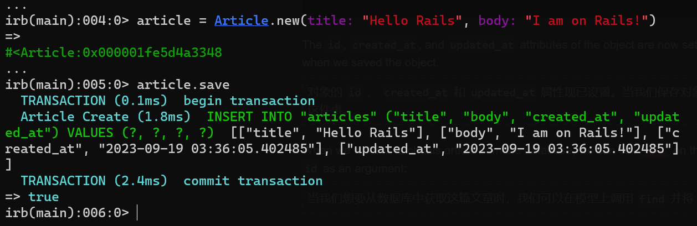

# ruby-on-rails-learn

## rails 常用命令

### 新建项目
```bash
rails new blog      # 新建一个叫 blog 的项目
```

### 启动项目
在项目目录下执行
```bash
bin/rails server    # windows 下为 ruby bin\rails server  
```

### 生成控制器
```bash
bin/rails generate controller Articles index --skip-routes
```
生成控制器 ArticlesController，同时生成对应的视图文件，跳过路由配置（因为自己已经主动配置了这条路由）

### 生成模型
```bash
bin/rails generate model Article title:string text:text
```
生成模型 Article，同时也会生成对应的数据库迁移文件

### 执行数据库迁移
```bash
bin/rails db:migrate
```
执行数据库迁移，将模型 Article 对应的数据库表创建出来

### 打开 rails 控制台
```bash
bin/rails console
```
打开 rails 控制台，控制台是一个交互式编码环境，就像 irb 一样，但它也会自动加载 Rails 和我们的应用程序代码。

例如，打开它之后，我们手动建一个 Article 对象，然后保存到数据库中：
```bash
article = Article.new(title: "Hello Rails", body: "I am on Rails!")
```
```bash
article.save
```
可以看到，控制台会输出保存的结果和执行的 SQL，如果保存成功，会返回 true，否则返回 false。




